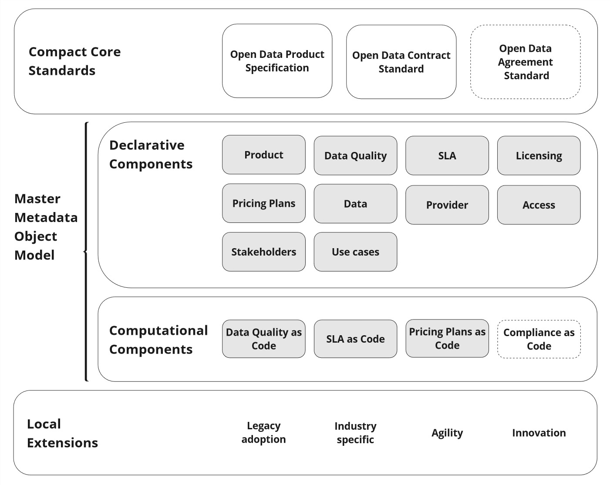

# Data Poduct Governance Interoperability framework

Terraforming Data Product Governace Interoperability Framework is a collection of data products, data contracts and data agreements related metadata models. 

