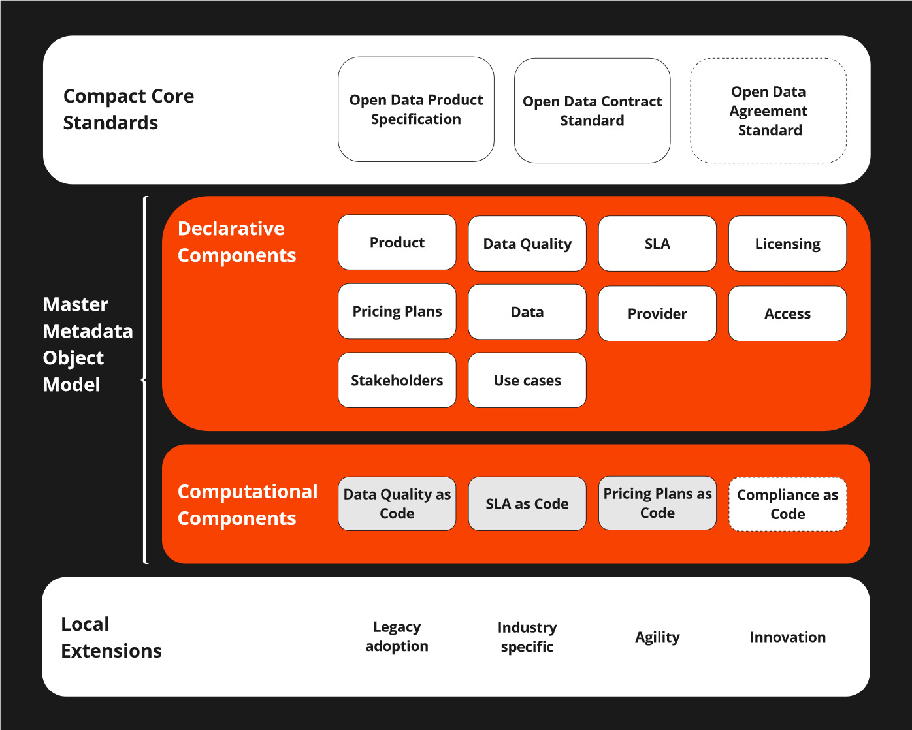

# Data Poduct Governance Interoperability framework

Terraforming Data Product Governace Interoperability Framework is a collection of data products, data contracts and data agreements related metadata models. 

In this repository you will find YAML models for the Declarative and Computational Components with one exception. At the moment Compliance as Code is not defined. 

## Product

## Pricing Plans

Standardized data pricing plans are crucial for transparency, scalability, and customer trust. They ensure that customers can easily understand and compare costs, fostering trust and reducing disputes. For providers, standardized pricing streamlines operations, supports scalability, and simplifies market comparison, allowing for effective competitive positioning. Additionally, it aids in better financial planning and forecasting for both the provider and the customer, ensuring predictable revenue and informed decision-making. Overall, standardized pricing is essential for the sustainable growth and success of data products.

Pricing is the process whereby a business sets the price at which it will sell its products and services. Pricing **OBJECT** contains pricing plans related metadata to be used for example in displaying the items in a marketplace. If needed the standard metadata is converted to marketplace internal format. We encourage all data product owners to enforce usage of this standard to foster global interoperability.  

The 12 pricing plans enabled by ODPS are meticulously defined through an in-depth analysis of pricing models applied across more than 300 data products. We continuously monitor the evolution of pricing plans in the data economy, striving to provide the most comprehensive and up-to-date list of standardized pricing options - yet some gaps might exist.

The Pricing object is general in nature and should be enough for common (80%) use cases. You can make extensions to the standard with "x-" mechanism in order to fulfill any industry specific needs. 

## Data Quality

## SLA

## Licensing

## Data

## Access

## Stakeholders

## Provider

## Use cases

